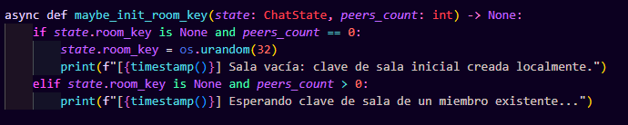

# Encry - E2EE Chat (MVP)

Alejandro Quiñones, Julio Prado, Juan David Acevedo, Martín Gómez Caicedo

This project implements a **console-based chat with End‑to‑End Encryption (E2EE)** using WebSockets.

The goal of the system is to demonstrate that messages **can only be read by the clients** participating in the room.  
The server acts solely as a **message relay** and never has access to the plaintext content.

---

# Architecture

- **Server (host)**
  - Manages WebSocket connections.
  - Forwards messages between clients.
  - Does not possess keys to decrypt content.

- **Clients**
  - Generate their own keys.
  - Perform key exchange between peers.
  - Encrypt and decrypt messages locally.

By design, the server only sees **ciphertext**.

---

# Cryptography Used

The system uses modern cryptographic primitives:

| Algorithm | Purpose |
|---|---|
| X25519 | Key exchange between peers |
| Ed25519 | Message signatures for authenticity |
| AES‑GCM | Authenticated message encryption |

Key generation 


Used when the client starts 


First client inits the room key 



Key exchange 


Stored when joined message arrives or peer_join


Shared key derivation (Diffie‑Hellman)


Simplified flow:

1. Each client generates encryption and signing keys.
2. Clients exchange public keys.
3. A **shared key** is derived.
4. Messages are encrypted with **AES‑GCM** before being sent.
5. The server only retransmits encrypted packets.

---

# Installation

## Option 1 — using `pip`

Create a virtual environment:

```bash
python -m venv .venv
```

Activate the environment:

**Linux / macOS**
```bash
source .venv/bin/activate
```

**Windows**
```bash
.venv\Scripts\activate
```

Install dependencies:

```bash
pip install -e .
```

---

## Option 2 — using `uv`

Synchronize dependencies:

```bash
uv sync
```

---

# Running the Project

## 1. Start the server

With pip:

```bash
python -m server.main --host 127.0.0.1 --port 8765
```

With uv:

```bash
uv run server --host 127.0.0.1 --port 8765
```

---

## 2. Run client 1

```bash
python -m client.main --user alice --room general
```

or

```bash
uv run client --user alice --room general
```

---

## 3. Run client 2

```bash
python -m client.main --user bob --room general
```

or

```bash
uv run client --user bob --room general
```


---

# Client Commands

| Command | Description |
|---|---|
| /help | Show help |
| /peers | List known peers |
| /quit | Exit the chat |

---

# Project Structure

```
client/
    main.py
    models.py
    runtime.py

server/
    main.py
    models.py
    runtime.py

crypto_utils.py
```

Description:

- **client/main.py** → Client CLI.
- **client/runtime.py** → Networking and encryption logic.
- **server/main.py** → WebSocket server.
- **server/runtime.py** → Message relay logic.
- **crypto_utils.py** → Shared cryptographic primitives.

---

# Privacy Verification with Wireshark

To demonstrate that the system satisfies the **End‑to‑End Encryption** property, network traffic was captured using **Wireshark**.

The objective of this analysis is to verify that:

- The server **does not receive plaintext**
- Messages travel **encrypted**
- Only clients can decrypt them

The capture was performed by monitoring traffic on the WebSocket server port.

---

# Capture 1 — WebSocket Traffic


## Analysis

In this capture we observe the WebSocket traffic generated by the application.

Packets appear as:

```
WebSocket Text [FIN] [MASKED]
WebSocket Ping
WebSocket Pong
```

This confirms that:

- Communication between client and server is performed via WebSockets

- Chat messages are transmitted inside WebSocket Text frames

- The message content is not visible in this view, since Wireshark only displays the frame type.

Using WebSockets allows maintaining a persistent connection between client and server to transmit messages in real time.

---

# Capture 2 — Full TCP Flow


## Analysis

In this capture the complete TCP/WebSocket connection flow is followed.

We observe:

1. Initial HTTP handshake
2. Upgrade to **WebSocket**
3. Exchange of encrypted frames

The server does not perform any decryption operation.

Packets contain only:

- encrypted blobs
- public keys
- nonces

No plaintext from the user’s message can be observed.

---

# Capture 3 — Payload Inspection


## Analysis

When directly inspecting the WebSocket packet payload, we observe JSON similar to:

```
{
"type": "message",
"sender": "alice",
"target": "bob",
"ciphertext": "...",
"nonce": "...",
"signature": "..."
}
```

The `ciphertext` field contains apparently random data.

This confirms that:

- the message content is not readable on the network
- only the client that possesses the key can decrypt it

---

# Conclusion

Traffic analysis confirms that:

- Messages **are not transmitted in plaintext**
- The server **does not have access to message contents**
- Confidentiality is preserved thanks to **End‑to‑End encryption**


Incluso teniendo acceso completo al tráfico de red, un observador solo puede ver **datos cifrados**, lo cual valida la propiedad de privacidad del sistema.
